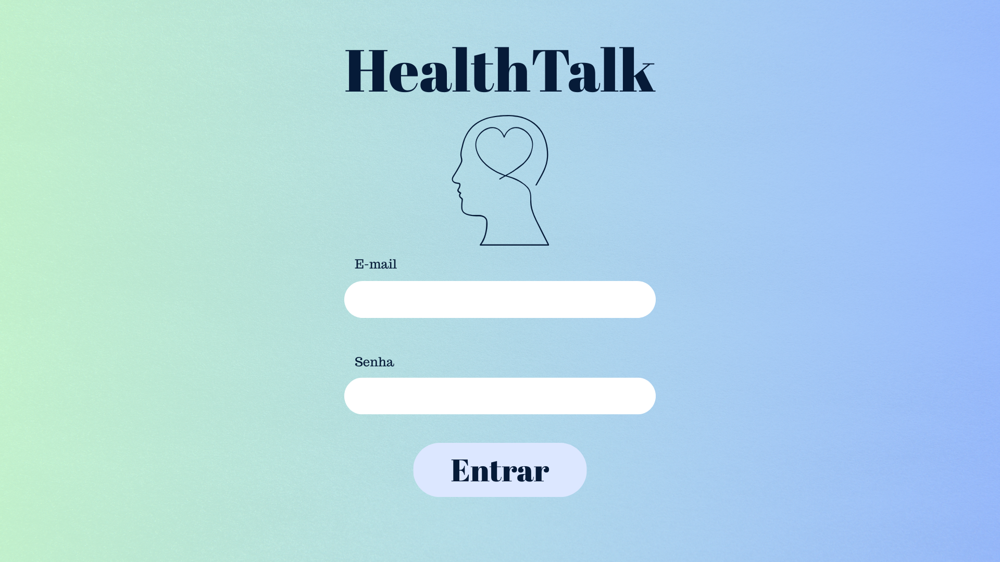
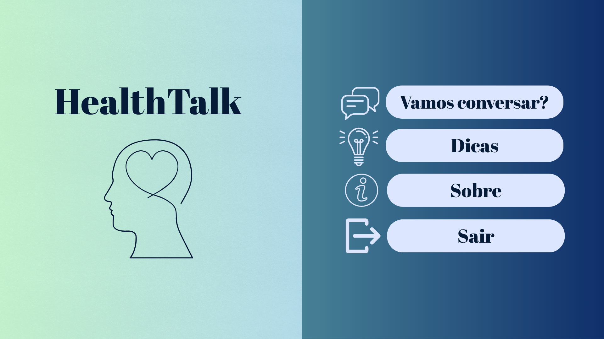
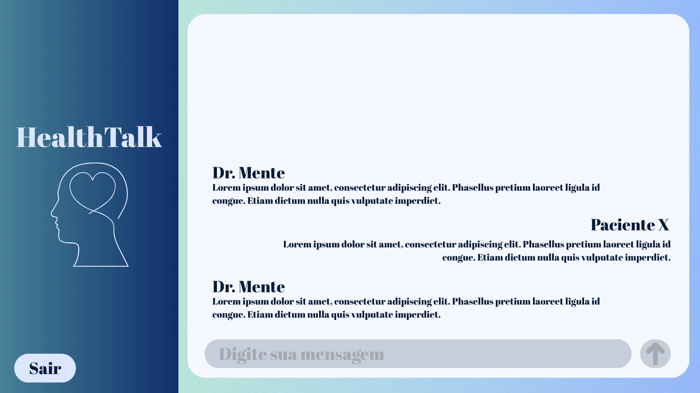
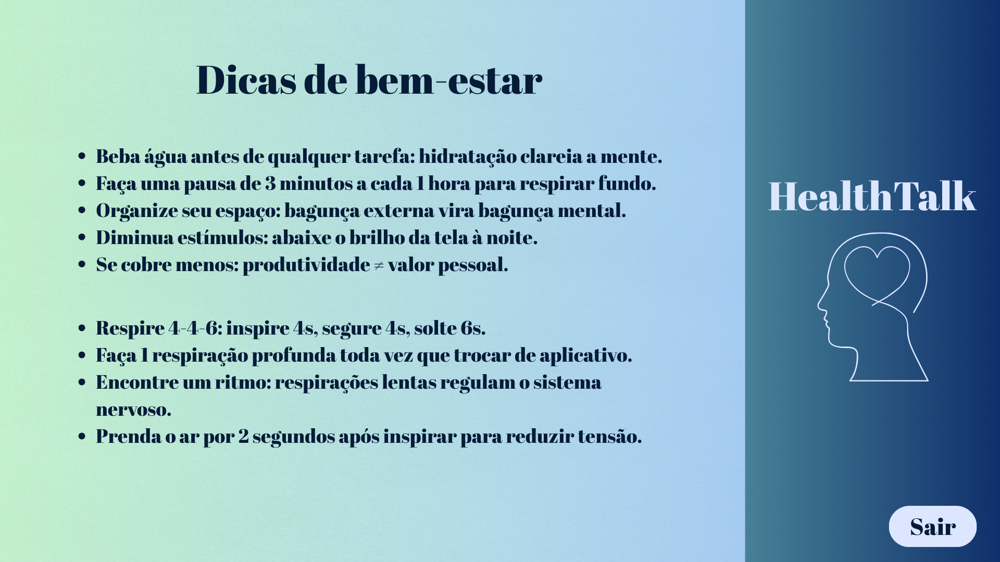

# HealthTalk

## Sobre o projeto

HealthTalk é uma aplicação criada para auxiliar pessoas que enfrentam dificuldades relacionadas à saúde mental, oferecendo um espaço seguro para conversar com uma Inteligência Artificial que fornece apoio inicial, escuta ativa e orientações básicas.

# Mídias

Em um cenário onde a saúde mental é cada vez mais discutida, o HealthTalk surge como uma ferramenta acessível e intuitiva. O usuário realiza um cadastro simples informando:

- Nome  
- Data de nascimento  
- E-mail  
- Sintomas relatados  

Após o cadastro, ele tem acesso a um menu que oferece:

- **Chat com a IA** – interação em tempo real para receber suporte  
- **Tela sobre os criadores** – informações sobre a equipe responsável pelo projeto  

---

## Tecnologias utilizadas

### Back-end
- Java  
- MySQL  
- Comunicação via API  

### Funcionalidades principais
- Cadastro de usuários  
- Armazenamento de dados no MySQL  
- Chat com IA integrada  
- Telas organizadas e intuitivas por menu  

---

## Objetivo do projeto

O HealthTalk tem como objetivo unir tecnologia e cuidado emocional, oferecendo um primeiro ponto de apoio para pessoas que buscam orientação, conforto ou simplesmente alguém — ou algo — com quem conversar.

---

## Autores

**Theo Viganó**

GitHub: https://github.com/TheoVigano

Se quiser, posso adicionar instruções de instalação, badges, prints da interface ou uma versão em inglês.
